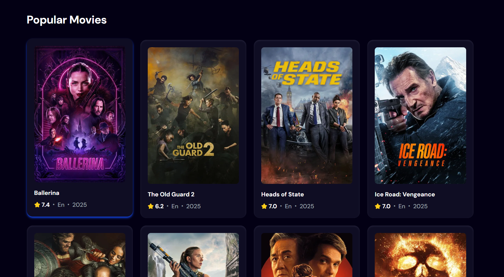
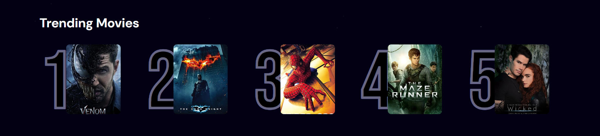

# 🎬 Cineverse | Movie Finder App

> A sleek and responsive React app that lets users search for movies and view trending picks using **TMDB API** and **Appwrite** for logging search analytics.


---

## 📦 Features

* 🔎 **Search Movies**: Search for any movie title using the TMDB API.
* 🔥 **Trending Movies**: Displays a list of trending movies (fetched from Appwrite DB).
* 📈 **Search Logging**: Each search is tracked and logged in Appwrite.
* ⏳ **Debounced Search**: Prevents excessive API calls by waiting for typing to pause.
* 💅 Built with **React**, **TailwindCSS**, and **Appwrite**.

---

## 🚀 Getting Started

### 1. Clone the Repository

```bash
git clone https://github.com/GRACE-wDEV/cineverse.git
cd cineverse
```

### 2. Install Dependencies

```bash
npm install
```

### 3. Environment Variables

Create a `.env` file in the root directory and add your TMDB API key:

```env
VITE_TMDB_API_KEY=your_tmdb_api_key_here
```

> 🔐 You can get a free API key from [https://www.themoviedb.org/](https://www.themoviedb.org/)

---

## 🧠 Project Structure

```
.
├── public/
│   └── hero.png              # Banner image
├── src/
│   ├── components/
│   │   ├── Search.jsx        # Search bar component
│   │   ├── MovieCard.jsx     # Card UI for individual movie
│   │   └── Spinner.jsx       # Loading spinner component
│   ├── appwrite.js           # Appwrite SDK integration for trending + logging
│   └── App.jsx               # Main app logic
├── .env
└── README.md
```

---

## ⚙️ API & Appwrite Setup

### TMDB API

* Used for:

  * `search/movie`: to search movies by name.
  * `discover/movie`: to fetch popular movies.

### Appwrite

Make sure your Appwrite project:

* Stores trending movies (`getTrendingMovies`)
* Logs the first search result per query (`updateSearchCount`)

---

## 🖼️ UI Overview

* `Search`: Controlled input with debounced updates.
* `MovieCard`: Displays poster, title, rating, etc.
* `Trending Section`: Pulled from Appwrite backend.
* Responsive layout powered by TailwindCSS.

---

## 🧪 How It Works

* `useDebounce` waits `1000ms` after typing to fire a search.
* If a search term is entered, fetches from `search/movie`, else from `discover/movie`.
* Trending movies load only once on initial render (`useEffect`).
* Movie data is fetched using `fetch` with a `Bearer` token for security.

---

## 📸 Screenshots

| Search & Results                  | Trending Movies                       |
| --------------------------------- | ------------------------------------- |
|  |  |

> Add your screenshots in a `screenshots/` folder.

---

## 🛠️ Tech Stack

* **React** – Frontend library
* **Tailwind CSS** – Utility-first styling
* **Appwrite** – Backend (trending & logging)
* **TMDB API** – Movie data

---

## 🧠 Future Improvements

* 🌙 Dark mode toggle
* 🗳️ Movie ratings and reviews
* 🧠 Search history analytics
* 📱 Progressive Web App (PWA)

---

## 📄 License

MIT © [Ahmed Emad](https://github.com/GRACE-wDEV/)
